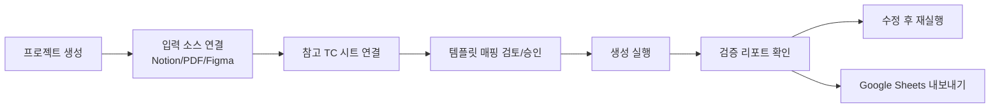

# TC 자동생성 웹도구 MVP 설계 v1

- 작성일: 2026-03-10 (KST)
- 대상 저장소: `makestar-qa-dashboard`
- 목적: Notion/PDF/Figma 입력 기반으로 테스트 케이스를 자동 생성하고 Google Sheets로 배포

## 1) 입력 소스 확인 결과

### 1.1 참고 TC (Google Sheets)
- 샘플 시트: `QA_TC_260219_Admin_포토카드SKU-OPP작업-2차` (`gid=1580439812`)
- CSV export 가능 확인
- 실제 헤더 구조 확인:
  - `No`
  - `Traceability`
  - `Depth 1`
  - `Depth 2`
  - `Depth 3`
  - `Pre-Condition`
  - `Step`
  - `Expected Result`
  - `Result`
  - `Issue Key`
  - `Description`
- 상단 Progress/Count 요약 블록이 존재하므로, 파싱 시 헤더 행 탐지가 필수

### 1.2 Notion PRD
- 문서 제목: `✅ 포토카드 SKU OPP 작업 어드민 내재화`
- 핵심 추출 포인트:
  - 상태 정의 테이블(입고 상태/작업 상태)
  - 핵심 과제 요약(리스트/상세/요청/작업 관리/알림)
  - 데이터 항목 테이블(필수/작성 방식/비고)
  - 변경 이력 및 FAQ(Outdated 블록 포함)

### 1.3 Figma
- 파일: `oa8dzzg1u2EddyuvGDzzH0`
- 기준 노드: `932:22568` (`입고~작업 관리 / 입고 전`)
- 확인된 UI 단서:
  - 검색 필터 + 현황 카드 + 테이블 + 페이지네이션 구조
  - 테이블 컬럼 라벨(예: SKU 코드, 이벤트 ID, 발주일, 총 판매량, 총 작업 요청량, 메모)
- 대형 프레임은 서브노드 분할 조회가 필요

## 2) MVP 범위

### 2.1 포함
- 입력: Notion URL, PDF 업로드, Figma URL/노드
- 참고 템플릿: Google Sheets URL로 Template Profile 자동 생성
- 생성: 시나리오 + 테스트케이스(Depth 1/2/3 포함)
- 검증: 중복/누락/형식 오류 자동 체크
- 출력: Google Sheets (`TC`, `Validation_Report`, `Coverage_Matrix` 탭)

### 2.2 제외
- Jira/TestRail 직접 연동
- 다국어 동시 생성
- 완전 자동 승인(항상 Human Review 1회)

## 3) 아키텍처

- Frontend: Next.js App Router + TypeScript
- Backend API: Next.js Route Handler (초기) + Python Worker(파싱/검증 고연산)
- Queue: Redis + BullMQ
- DB: PostgreSQL (Drizzle)
- Storage: S3 호환 스토리지(원본 PDF/중간 산출물)
- Integrations:
  - Notion API
  - Figma API/MCP
  - Google Sheets API

### 3.1 처리 파이프라인
1. Source Ingest
2. Requirement Normalize
3. Template Profile Build
4. Scenario Generate (CASE A/B 분기)
5. Test Case Generate
6. Validator 실행
7. Google Sheets Export

## 4) Template Profile 파싱 규칙 (확정)

### 4.1 헤더 탐지
- 첫 50행 탐색, 필수 컬럼 키워드 매칭 점수로 헤더 행 선택
- 필수 키 7개 이상 일치 시 헤더로 확정 (`Depth 1`, `Step`, `Expected Result` 등)

### 4.2 컬럼 매핑
- Canonical 컬럼 11개로 고정
- 별칭 매핑 지원
  - `Expected` -> `Expected Result`
  - `Precondition` -> `Pre-Condition`

### 4.3 Depth 처리
- 우선순위:
  1. `Depth 1~3` 명시 컬럼
  2. 번호 패턴(`1`, `1.1`, `1.1.1`)
  3. 시트 병합셀 fill-down 기반 그룹 추정

### 4.4 스타일 프로파일 추출
- Step 문체: 행위형 패턴 추출 (`클릭`, `입력`, `선택`)
- Expected 문체: 상태형 패턴 추출 (`노출됨`, `저장됨`, `불가함`)
- 1셀 1기대결과 규칙 기본값 ON

### 4.5 수동 보정 단계
- 최초 1회 컬럼 매핑 UI에서 승인
- 승인 결과를 `template_profiles`에 저장 후 재사용

## 5) API 명세 (MVP)

### 5.1 프로젝트/소스
- `POST /api/tc/projects`
  - 프로젝트 생성
- `POST /api/tc/projects/{projectId}/sources/notion`
  - body: `{ "url": "..." }`
- `POST /api/tc/projects/{projectId}/sources/pdf`
  - multipart 업로드
- `POST /api/tc/projects/{projectId}/sources/figma`
  - body: `{ "fileKey": "...", "nodeId": "..." }`

### 5.2 템플릿
- `POST /api/tc/projects/{projectId}/template/import-google-sheet`
  - body: `{ "sheetUrl": "...", "gid": "..." }`
  - 응답: column mapping 후보 + style profile
- `POST /api/tc/projects/{projectId}/template/approve`
  - body: `{ "profileId": "...", "mapping": {...} }`

### 5.3 생성 실행
- `POST /api/tc/projects/{projectId}/runs`
  - body: `{ "profileId": "...", "mode": "draft|strict" }`
- `GET /api/tc/runs/{runId}`
  - 생성 상태/요약/검증 결과
- `GET /api/tc/runs/{runId}/test-cases`
  - 생성된 TC 목록

### 5.4 내보내기
- `POST /api/tc/runs/{runId}/export/google-sheet`
  - body: `{ "spreadsheetId": "...", "targetSheetName": "TC_Generated" }`
  - 응답: 시트 URL

## 6) DB 스키마 (PostgreSQL 초안)

```sql
create table tc_projects (
  id uuid primary key default gen_random_uuid(),
  name text not null,
  owner_user_id text not null,
  created_at timestamptz not null default now()
);

create table tc_sources (
  id uuid primary key default gen_random_uuid(),
  project_id uuid not null references tc_projects(id) on delete cascade,
  source_type text not null check (source_type in ('notion','pdf','figma','google_sheet_template')),
  source_ref text not null,
  raw_content jsonb,
  created_at timestamptz not null default now()
);

create table tc_requirements (
  id uuid primary key default gen_random_uuid(),
  project_id uuid not null references tc_projects(id) on delete cascade,
  source_id uuid references tc_sources(id) on delete set null,
  requirement_key text,
  title text not null,
  body text not null,
  tags text[] default '{}',
  priority text,
  created_at timestamptz not null default now()
);

create table tc_template_profiles (
  id uuid primary key default gen_random_uuid(),
  project_id uuid not null references tc_projects(id) on delete cascade,
  name text not null,
  header_row_index int not null,
  column_mapping jsonb not null,
  style_profile jsonb not null,
  created_at timestamptz not null default now()
);

create table tc_generation_runs (
  id uuid primary key default gen_random_uuid(),
  project_id uuid not null references tc_projects(id) on delete cascade,
  profile_id uuid references tc_template_profiles(id) on delete set null,
  status text not null check (status in ('queued','running','failed','completed')),
  mode text not null check (mode in ('draft','strict')),
  model_name text,
  started_at timestamptz,
  finished_at timestamptz,
  error_message text,
  created_at timestamptz not null default now()
);

create table tc_test_cases (
  id uuid primary key default gen_random_uuid(),
  run_id uuid not null references tc_generation_runs(id) on delete cascade,
  no text,
  traceability text,
  depth1 text,
  depth2 text,
  depth3 text,
  pre_condition text,
  step text not null,
  expected_result text not null,
  result text,
  issue_key text,
  description text,
  created_at timestamptz not null default now()
);

create table tc_trace_links (
  id uuid primary key default gen_random_uuid(),
  requirement_id uuid not null references tc_requirements(id) on delete cascade,
  test_case_id uuid not null references tc_test_cases(id) on delete cascade,
  confidence numeric(4,3) not null
);

create table tc_validation_issues (
  id uuid primary key default gen_random_uuid(),
  run_id uuid not null references tc_generation_runs(id) on delete cascade,
  issue_type text not null check (issue_type in ('duplicate','missing','format')),
  severity text not null check (severity in ('low','medium','high')),
  target_ref text,
  message text not null,
  meta jsonb,
  created_at timestamptz not null default now()
);

create index idx_tc_sources_project on tc_sources(project_id);
create index idx_tc_requirements_project on tc_requirements(project_id);
create index idx_tc_runs_project on tc_generation_runs(project_id);
create index idx_tc_cases_run on tc_test_cases(run_id);
create index idx_tc_issues_run on tc_validation_issues(run_id);
```

## 7) 검증 로직 상세

### 7.1 중복
- Rule 1: `normalize(step + expected_result)` exact hash 중복
- Rule 2: 의미 유사도(embedding cosine) 0.92 이상 중복 의심
- Rule 3: 동일 traceability + 동일 depth 경로 중복

### 7.2 누락
- Requirement별 최소 1개 테스트케이스 연결 강제
- Notion 상태값 테이블(예: `입고 전/검수 중/입고 완료/재확인 요청`, `작업 대기/중/완료`)을 커버리지 체크포인트로 자동 등록
- CASE A 기능은 계산/정합성 검증 케이스 최소 3개 이상 강제

### 7.3 형식 오류
- 필수 컬럼 누락
- Step/Expected 빈값
- Expected에 다중 기대결과(접속사/줄바꿈 기준) 감지
- Result enum 이탈 (`Pass`, `Fail`, `Not Test`, `N/A`)

## 8) 화면 플로우



### 8.1 페이지 구성
- `/tc`: 프로젝트 목록 + 최근 실행 상태
- `/tc/projects/[id]`: 소스 연결/템플릿 승인/실행 버튼
- `/tc/runs/[runId]`: 생성 결과 테이블 + 검증 이슈 + 내보내기

## 9) MVP 백로그

### EPIC 1. 소스 수집/정규화
- T1. Notion URL 수집 및 구조 파서
- T2. PDF 텍스트/테이블 추출 + OCR fallback
- T3. Figma 노드 텍스트/테이블 라벨 파서
- DoD: Requirement Item JSON 생성 및 저장

### EPIC 2. 템플릿 프로파일링
- T4. Google Sheets CSV export 파서
- T5. 헤더 탐지/컬럼 매핑/Depth 추론
- T6. 스타일 프로파일 생성 + 승인 UI
- DoD: `template_profiles` 저장 및 재사용 가능

### EPIC 3. 생성 엔진
- T7. STEP1 전략 생성(CASE A/B + edge)
- T8. STEP2 테스트케이스 생성(표준 컬럼 스키마)
- T9. Traceability 자동 부여
- DoD: 한 번의 실행으로 TC Draft 산출

### EPIC 4. 검증/배포
- T10. 중복/누락/형식 검증기
- T11. Validation_Report/Coverage_Matrix 생성
- T12. Google Sheets write-back
- DoD: 결과물 공유 가능한 링크 출력

## 10) 2주 실행 계획

- Week 1
  - EPIC1 + EPIC2 완료
  - 템플릿 승인 UI 동작
- Week 2
  - EPIC3 + EPIC4 완료
  - 실제 Notion/Figma/Sheet 데이터로 E2E 리허설

## 11) 운영/보안 기준

- 업로드 파일은 실행 완료 후 기본 7일 보관, 이후 자동 삭제
- 개인정보 마스킹 규칙(이메일/전화번호/고객식별값) 적용 후 모델 전달
- 실행 로그에 원문 전체 저장 금지(요약/해시만 저장)

## 12) 재사용 로그

- 이번 문서는 제공된 링크의 구조와 요구사항을 참고해 작성함
- 외부 코드 직접 복사/재사용 없음
- 구현 중 직접 재사용 발생 시 링크/범위/라이선스 별도 기록 예정

## 13) 원문 링크

- TC: https://docs.google.com/spreadsheets/d/1l6UYgOwCj8IbZYEm5g2SXJEjv-JlYjj0Oyj8i2IZWjs/edit?gid=1580439812#gid=1580439812
- Figma: https://www.figma.com/design/oa8dzzg1u2EddyuvGDzzH0/OPP-%EC%8B%9C%ED%8A%B8-%EC%96%B4%EB%93%9C%EB%AF%BC-%EB%82%B4%EC%9E%AC%ED%99%94?t=XUPHVVz958g1j1UU-0
- Notion: https://www.notion.so/makestar/SKU-OPP-278c0f4dd8c8801ebaf2d7283808b235
